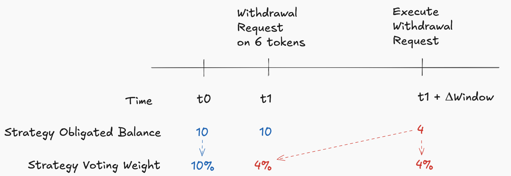
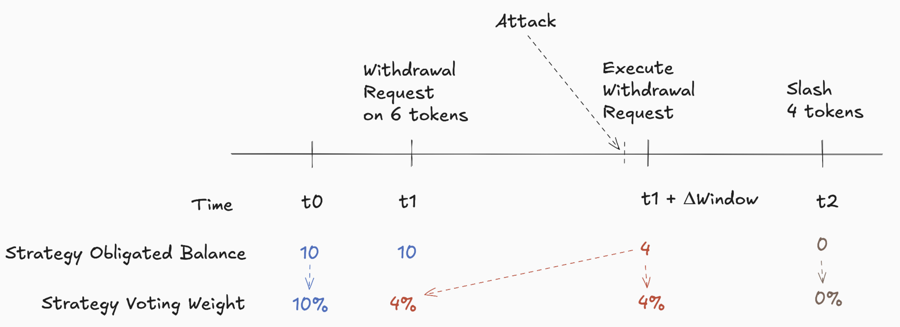
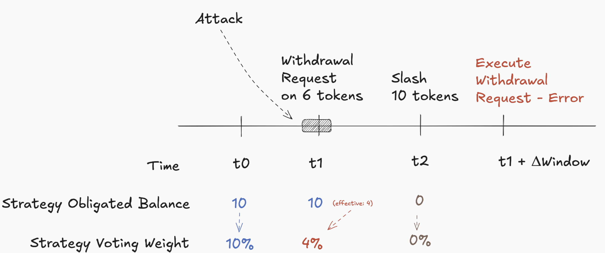
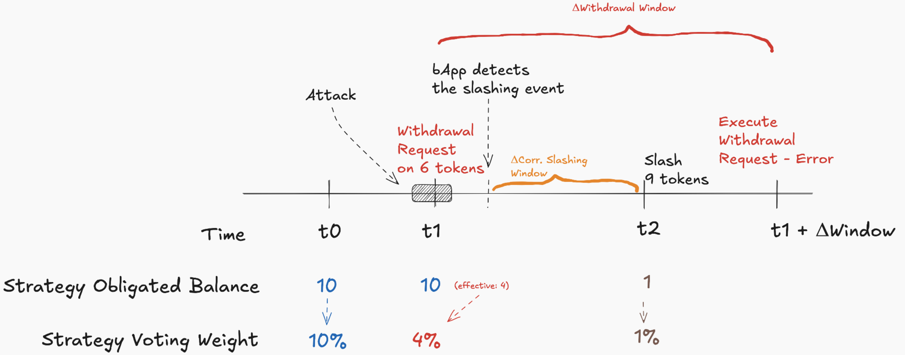

# Slashing & Withdrawals

> _This document describes the rationale and technical implementation of slashing and withdrawal mechanisms in the SSV Based Applications platform._

---

## 1. Rationale & Security Considerations

Slashing is particularly sensitive to withdrawal operations as they are the gateway for malicious strategies to attempt risk-free attacks — when a strategy commits slashable offenses and then withdraws its funds before suffering any penalty.

As a security mechanism, withdrawals are implemented as a two-step process:

1. **Withdrawal Request** (`proposeWithdrawal`) — strategy submits a request and records a share-based amount and timestamp.
2. **Execution** (`finalizeWithdrawal`) — after a configurable time window, the requested amount is released.

However, to fully prevent risk‑free attacks, bApps should **track pending withdrawals** and **immediately adjust the strategy’s voting weight** to reflect its _future_ obligated balance upon the request.

---

## 2. Illustrative Example



For simplicity, assume **X** obligated tokens correspond to **X%** of voting weight.

- At **t0**, the strategy’s voting weight is aligned with its obligated balance: 10 tokens ⇒ **10%** voting weight.
- At **t1**, the strategy calls `proposeWithdrawal(6)`. The bApp should immediately align the voting weight to reflect the _future_ obligated balance (10 − 6 = 4 tokens), reducing weight to **4%** even though the tokens remain until finalization.
- At **t1 + Δwindow**, executing the withdrawal releases the 6 tokens, leaving 4 tokens and **4%** weight.

| Time                       | Obligated Balance | Voting Weight |
|----------------------------|-------------------|---------------|
| **t0**                     | 10 tokens         | 10%           |
| **t1** (_after request_)   | 10 tokens         | **4%**        |
| **t1 + Δwindow** (finalize)| 4 tokens          | 4%            |

---

## 3. Late‑Attack Scenario



Therefore, if the strategy attacks **just before** `finalizeWithdrawal`, its attack power is already capped to **4%**. The bApp can still call `slash(...)` on the remaining obligated tokens, seizing those 4 tokens.

---

## 4. Early‑Attack Scenario



A strategy may attack at full **10%** voting power **before** the bApp detects its withdrawal request. In this case, although more powerful, the bApp can still fully slash up to **100%** of the obligation (10 tokens) at any point _during_ the withdrawal waiting period, preventing a risk‑free exit.

---

## 5. Correlated Slashing & Withdrawal Timing



When using correlated slashing, bApps often wait a delay Δ_slash after detecting a slashable offense before executing the penalty. To prevent a strategy from escaping in the gap:

```text
Δ_slashing < Δ_withdrawal
```

That is, the correlated slashing window must be **shorter** than the withdrawal timelock window, ensuring the slash occurs _before_ funds can be withdrawn.

---

## 6. Core On‑Chain Data Structures

Refer to `libraries/CoreStorageLib.sol` and `libraries/ProtocolStorageLib.sol` for complete definitions.

```solidity
// CoreStorageLib.Data
mapping(uint32 => mapping(address => mapping(address => ICore.WithdrawalRequest))) withdrawalRequests;
mapping(uint32 => mapping(address => mapping(address => ICore.Obligation)))       obligations;
mapping(address => mapping(address => uint256))                                      slashingFund;

// ProtocolStorageLib.Data
uint32 withdrawalTimelockPeriod;
uint32 withdrawalExpireTime;
uint32 disabledFeatures; // bitmask: slashingDisabled, withdrawalsDisabled, ...
```

---

## 7. Key Contract Snippets

### Propose Withdrawal

```solidity
function proposeWithdrawal(
    uint32 strategyId,
    address token,
    uint256 amount
) external {
    _checkWithdrawalsAllowed();
    _proposeWithdrawal(strategyId, token, amount);
}
```

### Finalize Withdrawal

```solidity
function finalizeWithdrawal(
    uint32 strategyId,
    IERC20 token
) external nonReentrant {
    _checkWithdrawalsAllowed();
    uint256 amount = _finalizeWithdrawal(strategyId, address(token));
    token.safeTransfer(msg.sender, amount);
}
```

### Slash Strategy

```solidity
function slash(
    uint32 strategyId,
    address bApp,
    address token,
    uint32 percentage,
    bytes calldata data
) external nonReentrant {
    _checkSlashingAllowed();
    uint256 slashable = getSlashableBalance(strategyId, bApp, token);
    uint256 amount    = (slashable * percentage) / MAX_PERCENTAGE;
    // delegate to bApp callback, adjust obligations or exit
    s.slashingFund[receiver][token] += amount;
}
```


## 8. Consequences for bApps

When a slashing event or withdrawal occurs, bApps face several technical and economic consequences:

### 8.1 Reduced Security Collateral
- **Obligated capital depletion**  
  Slashing permanently removes tokens from the strategy’s collateral. If the strategy was the only provider for that token, the bApp’s total secured stake decreases, potentially exposing it to higher risk.
- **Voting-weight impact**  
  Reduced obligations also lower the strategy’s voting weight, which may affect governance quorum and the bApp’s ability to influence protocol parameters.

### 8.2 Financial Flows
- **Slashing fund accrual**  
  Upon a slash, the bApp (or designated receiver) accumulates funds in its `slashingFund` balance. These can be withdrawn via `withdrawSlashingFund(...)`:
  ```solidity
  function withdrawSlashingFund(address token, uint256 amount) external nonReentrant;
  ```
- **Capital rebalancing**  
  The bApp must decide whether to:
  1. **Replenish** obligations by incentivizing strategies to deposit more.
  2. **Adjust risk levels** or reduce service capacity to match the new collateral.

### 8.3 Governance and Reputation
- **Risk-level adjustment**  
  Repeated slashing may trigger bApp marketplace logic (off-chain or on-chain) to flag higher shared risk levels for delegators and integrators.
- **Strategy exit**  
  If a strategy’s obligations drop to zero (full exit), the bApp loses that collateral entirely and must opt-in a new strategy or await new deposits.

## 9. Slashing Mechanism Details

This section consolidates the detailed behavior of the `slash(...)` function for both compliant and non‑compliant bApps, as well as post‑slashing rules and the slashing fund lifecycle.

### 9.1 Modes of Invocation

**1) Compliant bApp (Smart Contract implementing `IBasedApp`)**

- The platform calls:
  ```solidity
  (success, receiver, exit) = IBasedApp(bApp).slash(
      strategyId,
      token,
      percentage,
      msg.sender,
      data
  );
  ```
- `data` is forwarded, often containing proofs or auxiliary input.
- The bApp contract decides:
  - **Receiver** of slashed funds (e.g. burn with `address(0)` or send to a treasury).
  - **Exit or Adjust**:
    - If `exit == true`, the strategy’s obligation percentage is set to 0 (full exit).
    - Otherwise, obligations are reduced proportionally:
      ```solidity
      newObligated = oldObligated - amount;
      newTotal    = oldTotal - amount;
      obligation.pct = newObligated * MAX_PERCENTAGE / newTotal;
      ```
- Finally, the slashed `amount` is credited to `slashingFund[receiver][token]`.

**2) Non‑Compliant bApp (EOA or contract not supporting `IBasedApp`)**

- Only the bApp address itself can invoke `slash(...)`.
- Receiver is forcibly `bApp` address.
- Strategy always **exits**: obligation percentage → 0.
- Slashed tokens accumulate in `slashingFund[bApp][token]`.

### 9.2 Post‑Slashing Rules

- **Re‑opt‑in Timelock**  
  After a strategy obligation is exited (percentage == 0), a new obligation can only be created again after the protocol’s **obligation timelock** (default 14 days). This prevents immediate re‑entry and enforces deliberate participation.

### 9.3 Slashing Fund Lifecycle

- **Accrual**  
  Slashed tokens are held in an internal fund (`slashingFund` mapping) until withdrawal.

- **Withdrawal**  
  The designated receiver calls:
  ```solidity
  function withdrawSlashingFund(address token, uint256 amount) external nonReentrant;
  function withdrawETHSlashingFund(uint256 amount) external nonReentrant;
  ```
  under non‑zero and balance‑checked preconditions.

- **Economic Impact**  
  Withdrawn funds are immediately available to the receiver, while the strategy’s capital and voting power remain permanently reduced.


